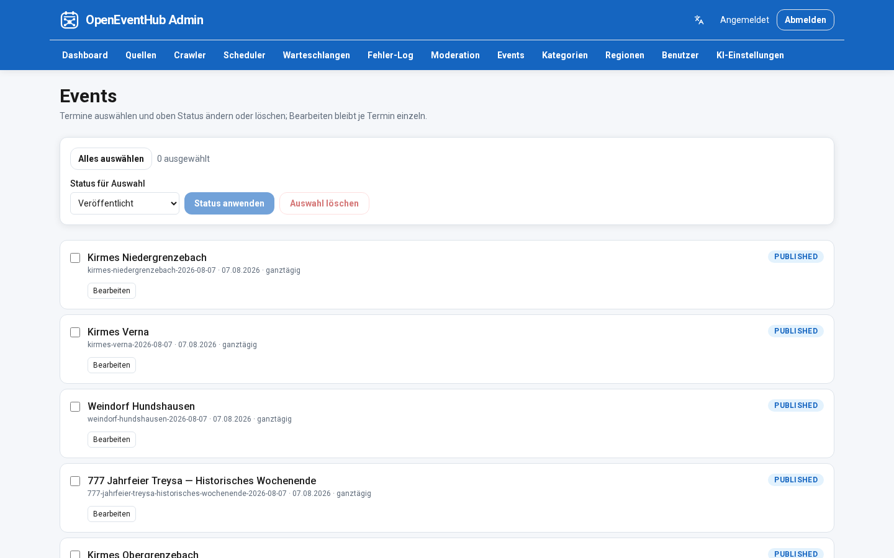

# Admin Center

> Sprache: Deutsch (primär) · [English](en/ADMIN_CENTER.md)

## Dashboard
- Systemstatus
- Crawl-Übersicht
- AI-Status
- Queue-Status (Zähler)
- Letzte Imports
- Fehlerübersicht (nur Zähler) mit Link zum **Fehler-Log**

## Fehler-Log
- Tabellarische Liste aktueller Fehler inkl. Gründe
- Quellen: BullMQ (`failedReason`), fehlgeschlagene Crawl-Jobs, Quellen-`lastError`

## Verwaltung
- Quellen (anlegen / bearbeiten / aktivieren / deaktivieren / löschen; Plugin-Typen
  `html` / `rss` / `ics` / `toubiz`; Aktualisierungsintervall per Dropdown; optional eigener Cron)
- Veranstaltungen (Tabellenansicht: Filter/Sortierung in Spaltenköpfen; Checkbox-Auswahl
  mit kompakter Bulk-Leiste für Status/Löschen; Bearbeiten je Zeile;
  Header zeigt Anzahl `pending_moderation`)
- Kategorien (Tabelle mit Spaltenfilter/-sortierung; manuell anlegen / bearbeiten / löschen;
  KI legt fehlende per Find-or-create an und verknüpft)
- Regionen (Tabelle mit Spaltenfilter/-sortierung; manuell anlegen / bearbeiten / löschen;
  KI kann Orte/Hierarchie per Find-or-create ergänzen)
- Moderation
- Benutzer & Rollen
- AI-Einstellungen (Provider-Profile anlegen / bearbeiten / löschen; Standard: Local Ollama; Profil-Test mit sofortigem Dialog inkl. Warteanzeige)
- Scheduler (lesbare Intervalle + nächster Lauf; Konfiguration unter Quellen)

## Mehrsprachigkeit (UI)

- Unterstützte Locales: **`de`** (Default), **`en`**
- Ermittlung: Cookie `oeh_locale` → Browser-`Accept-Language` → Default **Deutsch**
- Sprachwähler im Admin-Chrome; gleiche Cookie-Konvention wie das öffentliche Portal
- Message-Dateien: `services/admin/src/i18n/messages/{de,en}.ts`

## Visuelle Sprache

Flaches UI analog zum öffentlichen Portal (Primärblau-AppBar, abgerundete Buttons, keine Hintergrund-Verläufe).

## Branding (White-Label)

- **Logo:** Dateien unter `services/admin/public/brand/` ersetzen und/oder
  `NEXT_PUBLIC_ADMIN_LOGO_URL` setzen (z. B. `/brand/mark.png`)
- **Titel:** `NEXT_PUBLIC_ADMIN_TITLE` (Header, Login, Browser-Titel); Default `OpenEventHub Admin`
- `NEXT_PUBLIC_*`-Werte werden beim **Image-Build** eingebettet — Admin-Image neu bauen nach Änderung

## Navigation

Gruppiertes, aufklappbares Menü:

| Gruppe | Einträge |
|--------|----------|
| Übersicht | Dashboard |
| Inhalt | Events, Moderation, Kategorien, Regionen |
| Quellen | Quellen, Crawler, Scheduler |
| Betrieb | Warteschlangen, Fehler-Log |
| System | KI-Einstellungen, Benutzer |

## Screenshots

*Admin-Login*

*Admin-Dashboard*

*Quellenverwaltung*

*Events (Tabelle mit Spaltenfilter)*

*Moderation*

*KI-Einstellungen*

*Fehler-Log*
