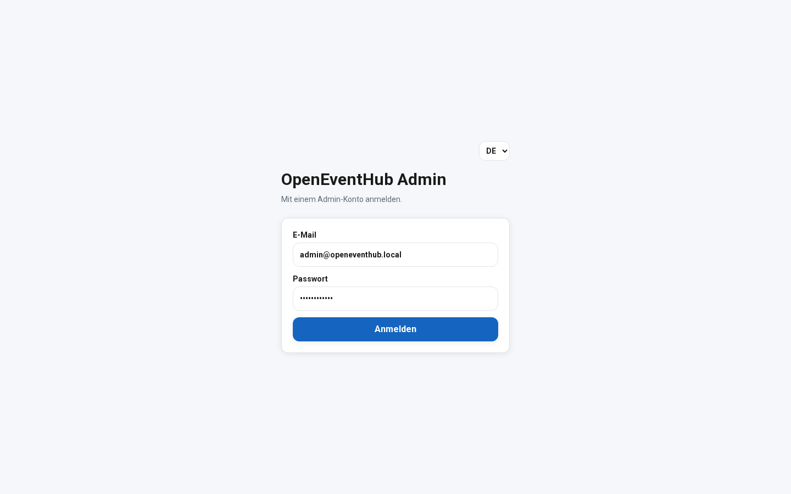
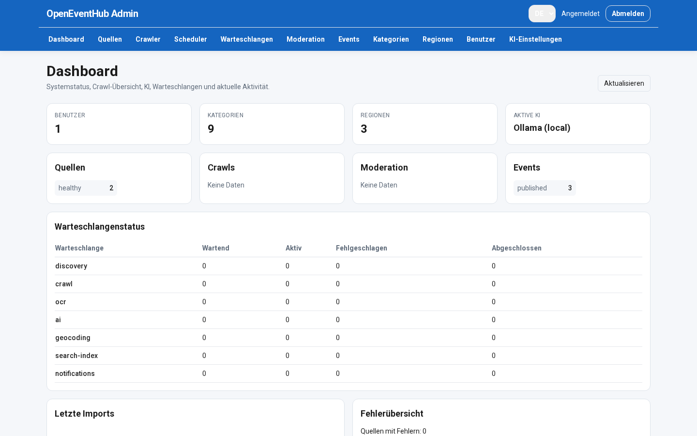
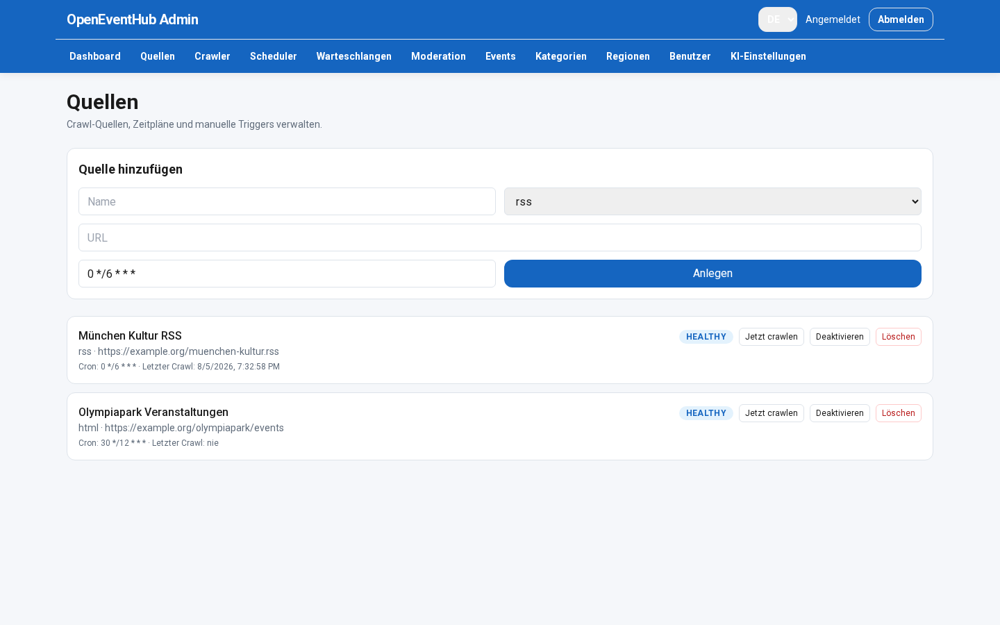
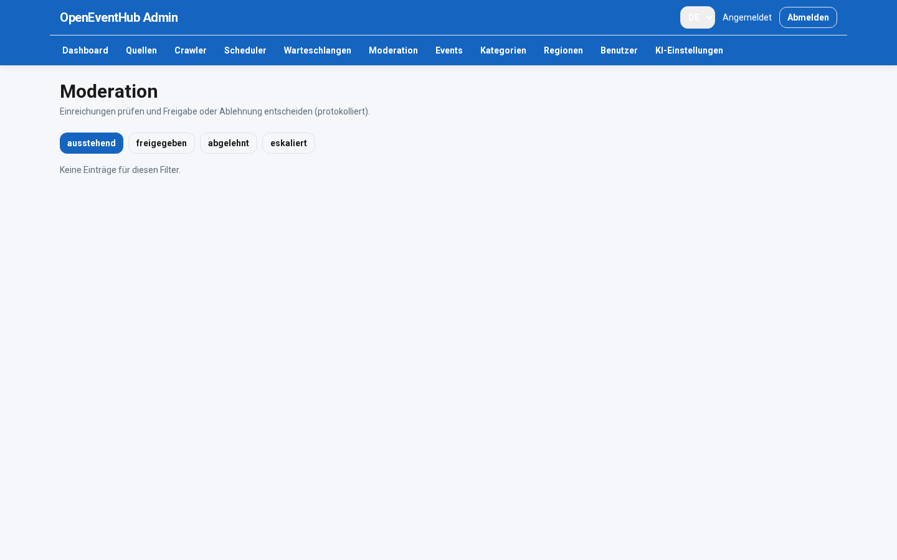
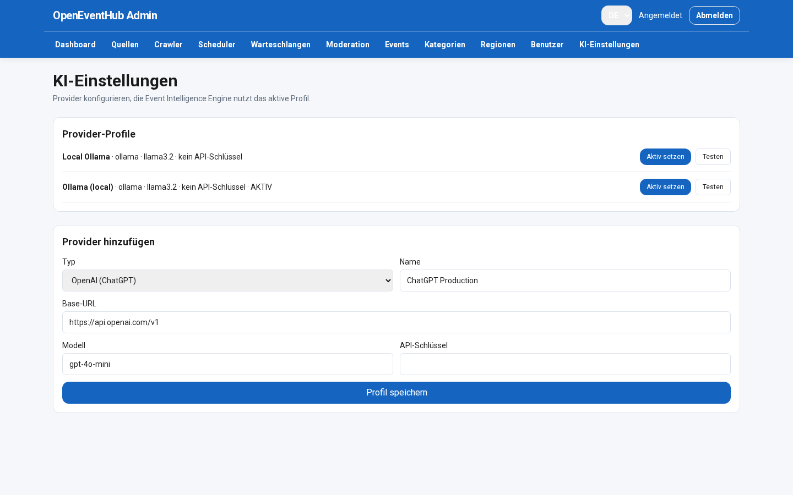

# Admin Center

> Sprache: Deutsch (primär) · [English](en/ADMIN_CENTER.md)

## Dashboard
- Systemstatus
- Crawl-Übersicht
- AI-Status
- Queue-Status
- Letzte Imports
- Fehlerübersicht

## Verwaltung
- Quellen
- Veranstaltungen
- Kategorien
- Regionen
- Moderation
- Benutzer & Rollen
- AI-Einstellungen
- Scheduler

## Mehrsprachigkeit (UI)

- Unterstützte Locales: **`de`** (Default), **`en`**
- Ermittlung: Cookie `oeh_locale` → Browser-`Accept-Language` → Default **Deutsch**
- Sprachwähler im Admin-Chrome; gleiche Cookie-Konvention wie das öffentliche Portal
- Message-Dateien: `services/admin/src/i18n/messages/{de,en}.ts`

## Visuelle Sprache

Flaches UI analog zum öffentlichen Portal (Primärblau-AppBar, abgerundete Buttons, keine Hintergrund-Verläufe).

## Screenshots

*Admin-Login*

*Admin-Dashboard*

*Quellenverwaltung*

*Moderation*

*KI-Einstellungen*
