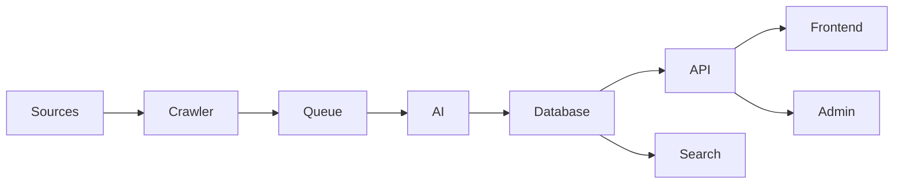

# OpenEventHub Architecture

## Architectural Principles

- Container First
- API First
- Plugin First
- Event-Driven
- AI-Assisted
- Horizontal Scalability

## High-Level Overview

## Core Services

| Service | Responsibility |
|----------|----------------|
| Frontend | Public portal |
| Admin | Administration |
| API | REST & GraphQL |
| Scheduler | Starts crawl jobs |
| Worker | Background processing |
| Crawler | Collects raw data |
| AI Engine | Extraction & deduplication |
| OCR | Reads PDFs & images |
| Search | Full-text & semantic search |
| PostgreSQL | Primary database |
| Redis | Queue & cache |
| SeaweedFS (S3) | Object storage |
