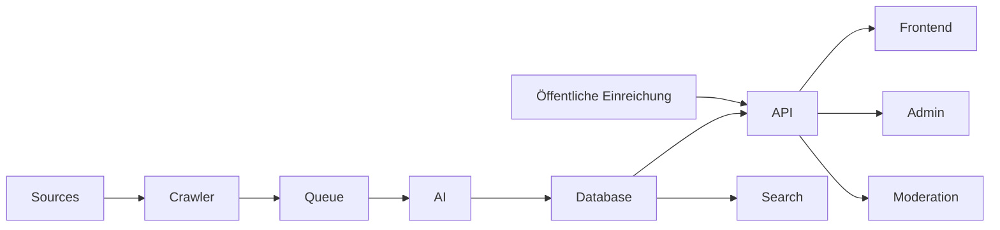
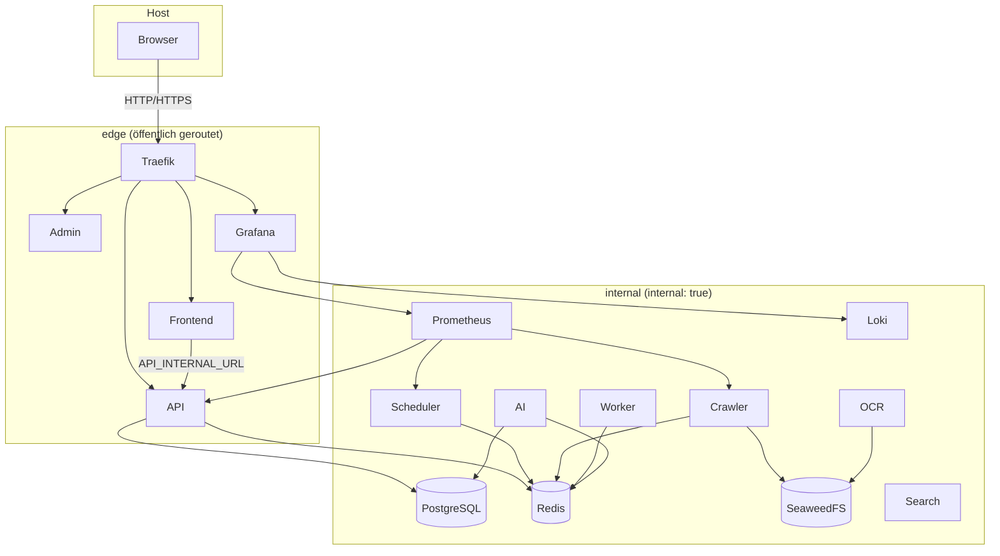

# OpenEventHub-Architektur

> Sprache: Deutsch (primär) · [English](en/ARCHITECTURE.md)

## Architekturprinzipien

- Container First
- API First
- Plugin First
- Event-Driven
- AI-Assisted
- Horizontale Skalierbarkeit

## Überblick auf hoher Ebene

## Kernservices

| Service | Verantwortung |
|----------|----------------|
| Frontend | Öffentliches Portal (Liste, Kalender, Karte, Suche, Einreichen) |
| Admin | Administration & Moderation |
| API | REST & GraphQL |
| Scheduler | Startet Crawl-Jobs |
| Worker | Hintergrundverarbeitung |
| Crawler | Sammelt Rohdaten (Plugins) |
| AI Engine | Extraktion & Deduplizierung |
| OCR | Liest PDFs & Bilder |
| Search | Volltext- & semantische Suche |
| PostgreSQL | Primäre Datenbank |
| Redis | Queue & Cache |
| SeaweedFS (S3) | Objektspeicher |
| Traefik | Einziger Host-Entrypoint (edge) |

## Netzwerktrennung

Siehe `docs/COMMUNICATION.md` und `docs/DOCKER_COMPOSE.md`.
