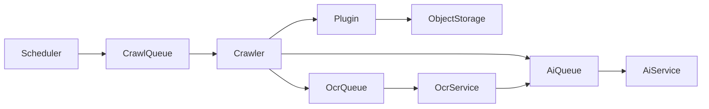

# Crawler Framework

> Sprache: Deutsch (primär) · [English](en/CRAWLER_FRAMEWORK.md)

## Ziele

- Neue Veranstaltungen automatisch entdecken
- Dauerhaft über geplante Jobs laufen
- Tausende Quellen unterstützen
- Plugin-basierte Architektur
- Fehlertolerant
- Horizontal skalierbar

## Pipeline

## Runtime (M5)

| Component | Role |
|-----------|------|
| `scheduler` | Registriert **einen** Repeatable-Job pro Cron-Muster; der Crawler tickt Quellen seriell |
| `crawler` | Konsumiert `crawl`, führt den Plugin-Lebenszyklus aus, speichert Raw-Payloads, überspringt unveränderte Hashes; bei Plugin-Events **ein AI-Job pro Kandidat** |
| `ocr-service` | Konsumiert `ocr` für Bild-/PDF-markierte Payloads, schreibt `.ocr.txt`, enqueued `ai` |
| `ai-service` | Konsumiert `ai` (Event Intelligence Engine) |
| `plugins/*` | Unabhängig deploybare Connectoren (`html`, `rss`, `ics`, `toubiz`) über das Plugin SDK |

Neue Quelltypen werden als Plugins unter `plugins/` mit einem `plugin.json`-Manifest hinzugefügt.
Core-Services entdecken sie beim Start (`PLUGINS_DIR`); Änderungen am Core-Code sind nicht erforderlich.

## Änderungserkennung

Wenn ein Crawl denselben `contentHash` wie ein vorheriges erfolgreiches Ergebnis
für dieselbe Quelle liefert, wird der Job als `skipped` markiert (kein erneutes
Object-Storage-Write). Nachgelagerte OCR-/AI-Jobs werden dennoch erneut enqueued,
damit ein früherer AI-/OCR-Fehler ohne Inhaltsänderung nachgeholt werden kann.
