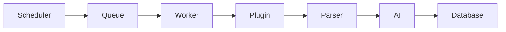

# Crawler Framework

## Goals

- Discover new events automatically
- Run continuously using scheduled jobs
- Support thousands of sources
- Plugin based architecture
- Fault tolerant
- Horizontally scalable

## Pipeline

