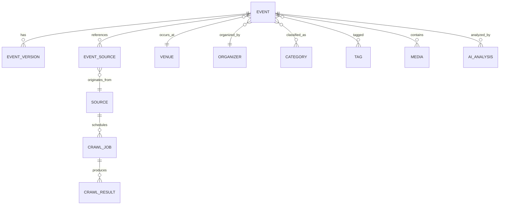

# OpenEventHub-Datenmodell

> Sprache: Deutsch (primär) · [English](en/DATA_MODEL.md)

## Kernprinzipien

- Eine logische Veranstaltung kann viele Quellen haben.
- Quelldaten sind möglichst unveränderlich.
- Die KI erzeugt normalisierte Event-Datensätze.
- Jede wichtige Änderung wird versioniert.

## Hauptentitäten

- Event
- EventVersion
- EventSource
- Source
- CrawlJob
- CrawlResult
- Organizer
- Venue
- Region
- Category
- Tag
- Media
- AIAnalysis
- ModerationItem
- UserSubmission

## Entity-Relationship

## Event-Lebenszyklus

Discovery → AI Extraction → Deduplication → Moderation (optional) → Publish → Versioning
