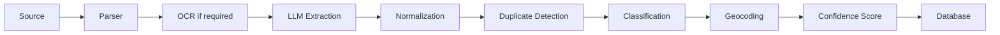

# Event Intelligence Engine (EIE)

> Sprache: Deutsch (primär) · [English](en/EVENT_INTELLIGENCE_ENGINE.md)

## Zweck

Die Event Intelligence Engine ist die Kernkomponente von OpenEventHub.

Verantwortlichkeiten:
- Veranstaltungen erkennen
- Strukturierte Informationen extrahieren
- Informationen aus mehreren Quellen zusammenführen
- Confidence Score berechnen
- Duplikate erkennen
- Kategorien zuweisen
- Regionen erkennen
- Organisatoren erkennen
- Venues erkennen
- Durchsuchbare Metadaten erzeugen

## Verarbeitungspipeline

## Persistenz nach Crawl-Ingest

Crawl-Jobs erzeugen zunächst `CrawlResult` (+ Object Storage) und stellen Rohinhalt
in die `ai`-Queue. Die EIE:

1. bereitet den Inhalt für das LLM auf (HTML → Klartext, Längenbegrenzung),
2. extrahiert und klassifiziert,
3. **Duplikaterkennung / Konsolidierung**: bei `isEvent` + Titel + `startAt` (und
   **noch nicht abgelaufen**: effektives Ende `endAt` bzw. `startAt` ≥ jetzt) —
   gleicher Source-`externalId` oder plattformweiter Match (Titel + UTC-Tag,
   Venue-kompatibel) → bestehendes Event anreichern und `EventSource` verknüpfen;
   sonst neues Event mit Status `pending_moderation` (inkl. `EventVersion`),
4. speichert `AIAnalysis` (Confidence berücksichtigt Source-Anzahl),
5. löst Klassifikations-Labels auf und verknüpft Kategorien
   (nur Katalog-Match / Aliases — keine Auto-Anlage neuer Kategorien),
   Tags und Orte (Find-or-create),
   Tags, Regionen und optional Venue.

Listen mit mehreren Terminen:

- Das **HTML-Plugin** (`1.3.0+`) erkennt Termine markup-unabhängig (Tabelle, Liste,
  Div/Divi, JSON-LD, `<time>`, Klartext-Datumszeilen) und eingebettete EMS-Widgets
  (Toubiz → API, **alle zukünftigen** Termine inkl. Pagination/`dateIntervals`).
- Der Crawler enqueued dann **einen AI-Job pro Kandidat** (strukturierter Kurztext),
  statt die komplette HTML-Seite einmalig an das LLM zu senden.
- Dediziertes Plugin `toubiz` für Quellen, die direkt als EMS angebunden werden.
- Fallback ohne Plugin-Treffer: Extraction-Prompt (`event-extraction` **1.0.2**)
  liefert weiterhin **ein** primäres Event pro Job (frühester datierter Eintrag).
- Strukturierte Plugin-Kandidaten werden auch dann persistiert, wenn das LLM
  `isEvent=false` setzt (Guard im AI-Service).
- Fehlt ein Ort, aber der **Titel** enthält einen Ortsnamen (z. B. `Kirmes Niedergrenzebach`,
  `Scherzmarkt in Treysa`), setzen Prompt und deterministische Nachverarbeitung
  `venueName` / `municipality` (Shared-Helper `inferPlaceFromTitle`).
- Überall gilt: **nur nicht abgelaufene** Termine (Plugins, Crawler-Filter, AI-Ingest).
- Ohne Uhrzeit in der Quelle: Events werden als **ganztägig** (`allDay`) gespeichert;
  UI und ICS zeigen dann **kein** erfundenes Uhrzeitfeld (kein `01:00`/`02:00` aus UTC-Mitternacht).

Ohne `eventId` und ohne creatable Extraction wird das AI-Ergebnis nicht persistiert
(Warnung im Log).
