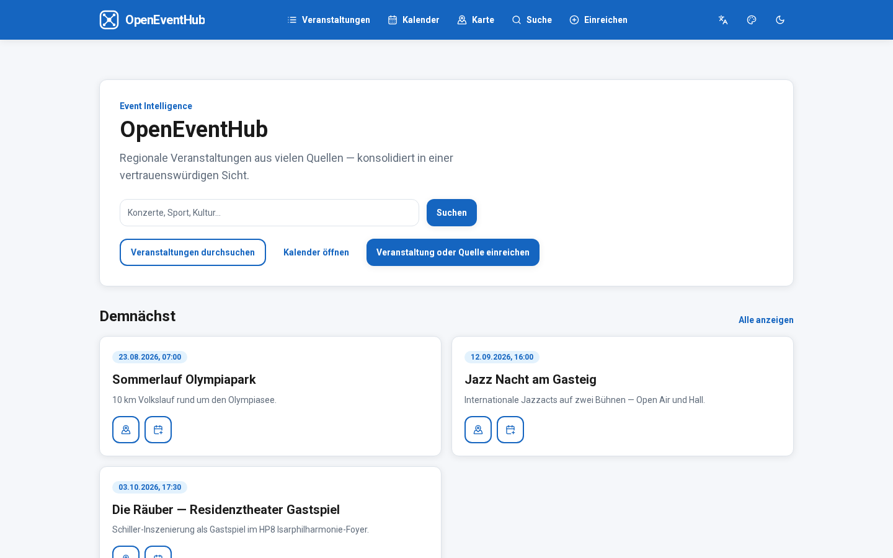
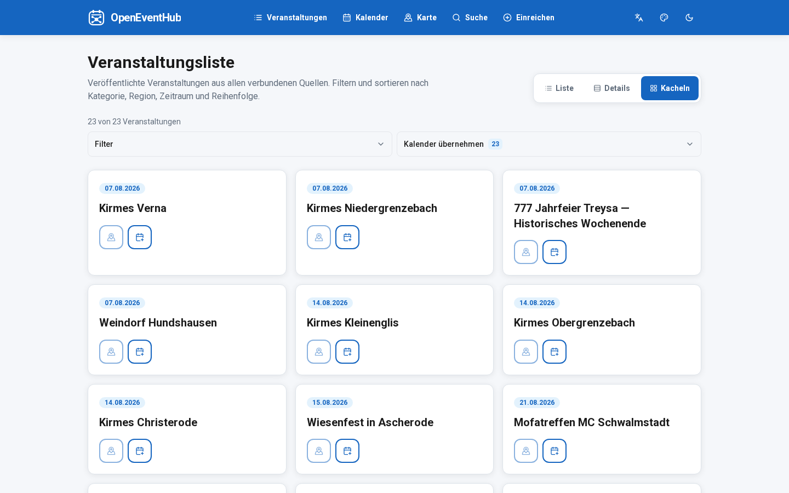
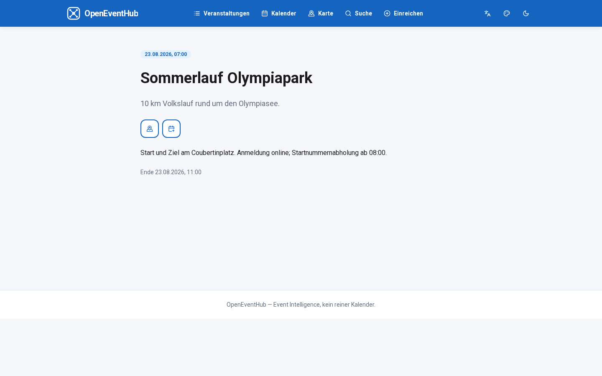
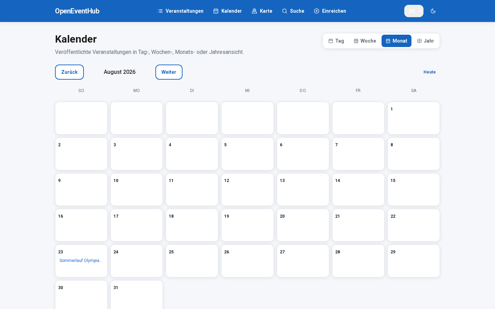
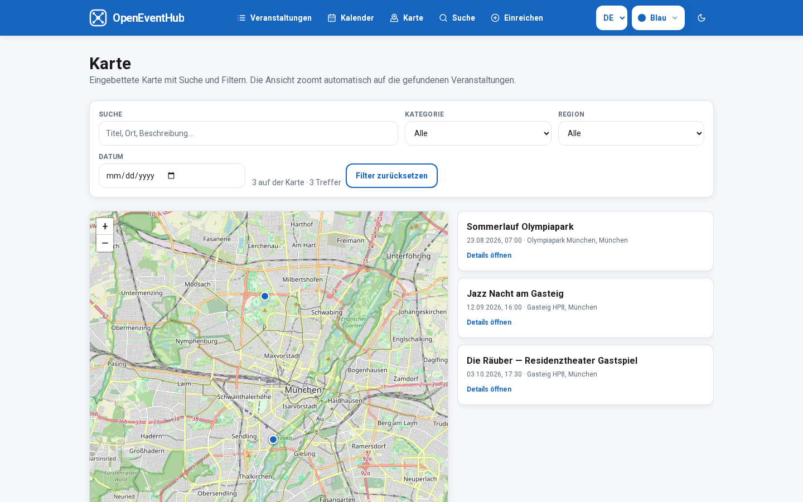
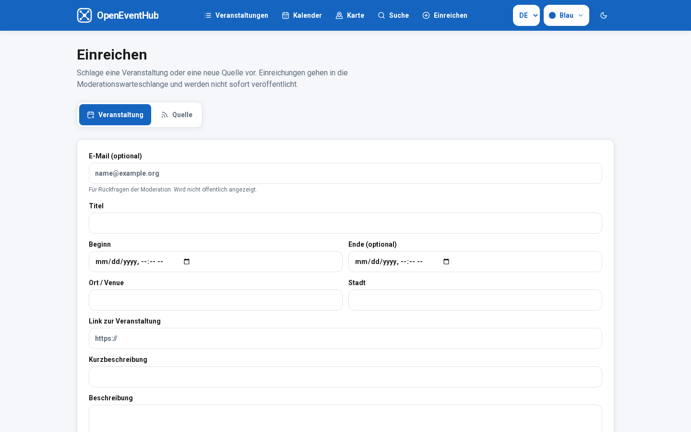
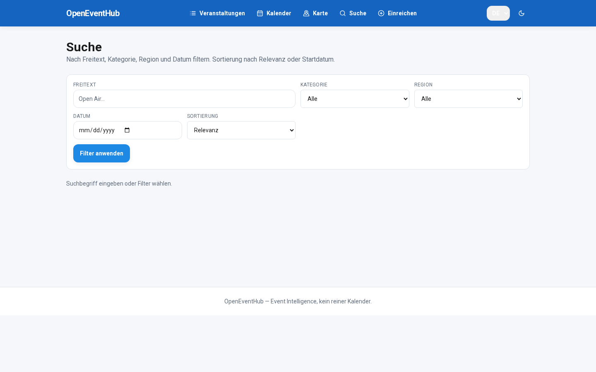
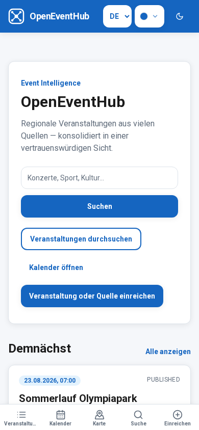

# Frontend

> Sprache: Deutsch (primär) · [English](en/FRONTEND.md)

Stack:
- Next.js
- React
- TailwindCSS
- shadcn/ui
- TanStack Query
- Leaflet (Karte)
- Apache ECharts (Termindichte-Heatmap)

## Visuelle Sprache

Flaches UI (an FestSchmiede angelehnt):
- solide Primär-/Akzentfarbe (Default Blau `#1565c0`), Sekundär/Teal (`#00838f`), Erfolg grün (`#2e7d32`)
- wählbare Akzentfarben über ein Palette-Icon in der Kopfzeile; Menü mit Farbpunkt + Name (nur WCAG-AA-sichere Paare für Light/Dark)
- Light/Dark-Modus und Akzent werden lokal im Browser gespeichert (`oeh-theme`, `oeh-accent`)
- Sprache und Erscheinung als schlanke Icon-Buttons (wie Dark/Light), kein Chip-Dropdown
- keine Hintergrund-Farbverläufe; helles Grau + weiße Flächen
- Roboto / Sans, fette Überschriften
- abgerundete Buttons (`12px`, einheitliche Höhe `44px` / `h-11` wie Inputs), flache Icons, leichte Kartenschatten
- solide Primär-AppBar (Kontrastschrift auf Akzent) mit flachem Brand-Mark vor dem App-Namen; Favicon unter `/brand/`
- **Responsive:** Bottom-Navigation auf Smartphones/Tablets (`< lg`), Desktop-Nav ab Large; Touch-Targets ≥ 44px; Safe-Area-Insets (Notch); 16px-Inputs gegen iOS-Zoom
- **PWA:** Web App Manifest, Install-Icons (192/512 + maskable), Apple Touch Icon, Service Worker (`/sw.js`) für Shell-Caching; „Zum Homescreen“ unter HTTPS

Ansichten:
- Startseite
- Veranstaltungsliste (Anzeigemodi: Liste, Details, Kacheln)
- Kalender (Tag, Woche, Monat, Jahr)
- Termindichte / Heatmap (eigene Seite: Jahr → Monat → Woche → Wochenende → Tag)
- Karte
- Veranstaltungsdetail
- Suchergebnisse
- Öffentliche Einreichung (Veranstaltung / Quelle → Moderationswarteschlange)

Event-Aktionen (Liste, Kacheln, Details und Detailseite):
- **Auf Karte anzeigen** / **In Kalender eintragen** — Icon-Buttons mit Hover-Tooltip (`title`/`aria-label`)
- Öffentliche Listen zeigen keinen Status wie „PUBLISHED“ (sichtbar = veröffentlicht)
- **Bulk-Export / Abonnement:** unter „Kalender übernehmen“ als aufklappbare Zusatzfunktion (standardmäßig zugeklappt); gefilterte Treffer als `.ics` oder Online-Feed (`/calendar.ics` / `/api/v1/calendar.ics`, `webcal://`)

## Mehrsprachigkeit (UI)

- Unterstützte Locales: **`de`** (Default), **`en`**
- Ermittlung: Cookie `oeh_locale` → Browser-`Accept-Language` → Default **Deutsch**
- Manuelle Umschaltung über Sprach-Icon in der Kopfzeile (setzt Cookie; Klick wechselt DE ↔ EN)
- Message-Dateien: `services/frontend/src/i18n/messages/{de,en}.ts`

## Mobile & PWA

- Viewport: `device-width`, `viewport-fit=cover`, Theme-Color
- Navigation: feste Bottom-Bar mit Icons unter `lg`; ab Desktop horizontale Kopfzeilen-Nav
- Kalender Monatsraster: auf schmalen Screens kompakte Zellen mit Event-Anzahl; ab `sm` Event-Chips
- Karte: Höhen an `dvh` angepasst, damit die Bottom-Bar nicht die Karte verdeckt
- Manifest: `/manifest.webmanifest` (Next.js `app/manifest.ts`)
- Service Worker: nur in Production-Builds registriert (`PwaRegister`); API/Health-Routen werden nicht gecacht
- Betrieb: öffentliche HTTPS-URL (`NEXT_PUBLIC_SITE_URL`); Install-Prompt erscheint nach Manifest + SW

## Anzeigemodi

### Veranstaltungen
- **Liste** — kompakte Zeilen
- **Details** — erweiterte Listeneinträge mit Summary/Beschreibung
- **Kacheln** — Kartenraster
- Filter und Sortierung als aufklappbares Panel (standardmäßig zugeklappt): Kategorie, Region, Zeitraum (Von/Bis), Sortieren nach (Startdatum/Titel), Auf-/Absteigend — aktiver Filter wird am Toggle als Badge angezeigt

### Kalender
- **Tag** / **Woche** / **Monat** / **Jahr**
- Navigation inkl. „Heute“; Klick auf Tag wechselt in die Tagesansicht

Gewählte Modi werden lokal im Browser gespeichert (`oeh_view_*`).

### Termindichte (Heatmap)
- Eigene Route `/heatmap` (Kalender bleibt unverändert)
- Visualisierung mit **Apache ECharts** (`heatmap` + `calendar`-Koordinatensystem)
- Zoom: **Jahr** / **Monat** / **Woche** / **Wochenende** (Fr–So) / **Tag** (Klick zoomt tiefer)
- Filter (aufklappbar): Kategorie, Region
- Dependency: `echarts` im Frontend-Workspace

## Karte

- Eingebettete OpenStreetMap-Karte (Leaflet)
- Marker für alle veröffentlichten Events mit Venue-Koordinaten
- Suche + Filter (Kategorie, Region, Datum); Marker und Liste folgen dem Filter
- Auto-Zoom (`fitBounds`) auf die aktuellen Treffer, mit begrenztem Zoom und Padding
- Deep-Link: `/map?event=<id>` wählt den Marker (aus Listen/Detail-Aktionen)

## Einreichen

Öffentliche Formulare unter `/submit`:
- **Veranstaltung** — Titel, Zeitraum, Ort, Beschreibung (optional E-Mail)
- **Quelle** — Name, URL, Plugin-Typ (`rss` / `html` / `ics`), Aktualisierungsintervall per Dropdown (optional eigener Cron)

Einreichungen gehen über `POST /api/v1/submissions` bzw. `POST /api/v1/source-submissions` in die Moderationswarteschlange (Admin → Moderation). Direkte Freischaltung erfolgt nicht.

## Screenshots

*Startseite*

*Veranstaltungsliste*

*Veranstaltungsdetail*

*Kalender*

*Karte*

*Öffentliche Einreichung*

*Suche*

*Startseite (Smartphone / Bottom-Navigation)*
