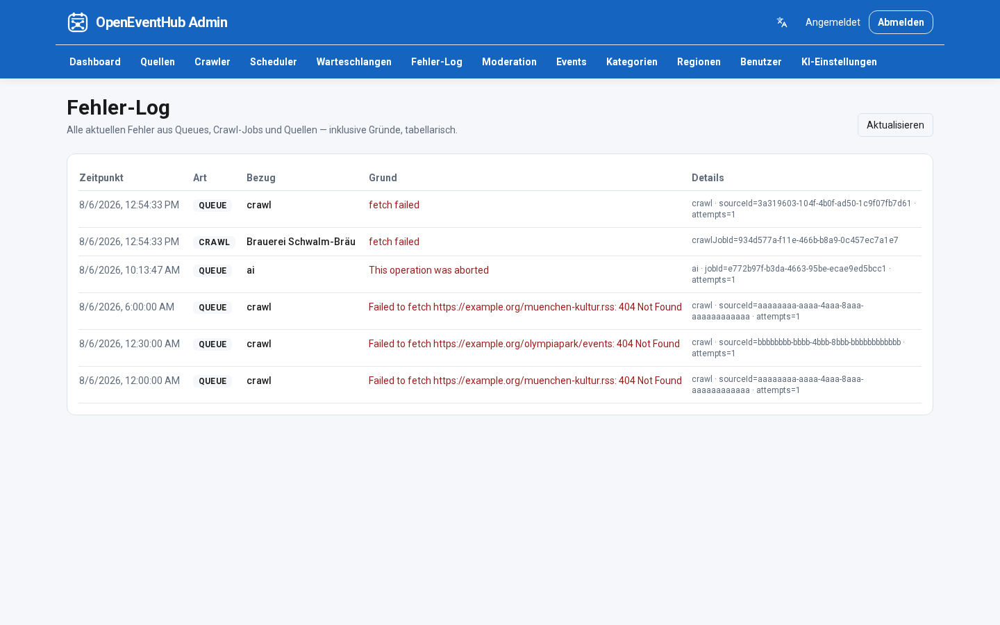

# Admin Center

> Language: English · [Deutsch (primary)](../ADMIN_CENTER.md)

## Dashboard
- System status
- Crawl overview
- AI status
- Queue status (counts)
- Recent imports
- Error summary (counts only) with a link to the **Error log**

## Error log
- Tabular list of current failures including reasons
- Sources: BullMQ (`failedReason`), failed crawl jobs, source `lastError`

## Management
- Sources (create / edit / enable / disable / delete; plugin types
  `html` / `rss` / `ics` / `toubiz`; update interval via dropdown; optional custom cron)
- Events (edit, change status, delete; updates create EventVersion)
- Categories (manual create / edit / delete; AI find-or-creates missing labels and links them)
- Regions (manual create / edit / delete; AI may find-or-create places/hierarchy)
- Moderation
- Users & Roles
- AI Settings (create / edit / delete provider profiles; default: Local Ollama; profile test opens a dialog with a waiting indicator)
- Scheduler (plain-language intervals + next run; configured under Sources)

## UI languages

- Supported locales: **`de`** (default), **`en`**
- Resolution: cookie `oeh_locale` → browser `Accept-Language` → default **German**
- Language switcher in admin chrome (same cookie as public portal)
- Messages: `services/admin/src/i18n/messages/{de,en}.ts`

## Visual language

Flat UI matching the public portal (primary-blue app bar, rounded buttons, no background gradients).

## Screenshots

*Admin login*

*Admin dashboard*

*Sources management*

*Moderation*

*AI Settings*

*Error log*
