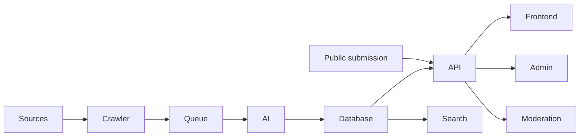
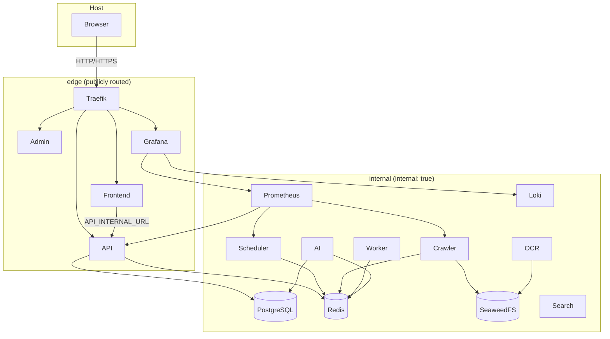

# OpenEventHub Architecture

> Language: English · [Deutsch (primary)](../ARCHITECTURE.md)

## Architecture principles

- Container First
- API First
- Plugin First
- Event-Driven
- AI-Assisted
- Horizontal scalability

## High-level overview

## Core services

| Service | Responsibility |
|---------|----------------|
| Frontend | Public portal (list, calendar, map, search, submit) |
| Admin | Administration & moderation |
| API | REST & GraphQL |
| Scheduler | Starts crawl jobs |
| Worker | Background processing |
| Crawler | Collects raw data (plugins) |
| AI Engine | Extraction & deduplication |
| OCR | Reads PDFs & images |
| Search | Full-text & semantic search |
| PostgreSQL | Primary database |
| Redis | Queue & cache |
| SeaweedFS (S3) | Object storage |
| Traefik | Sole host entrypoint (edge) |

## Network separation

See `docs/COMMUNICATION.md` and `docs/DOCKER_COMPOSE.md`.
