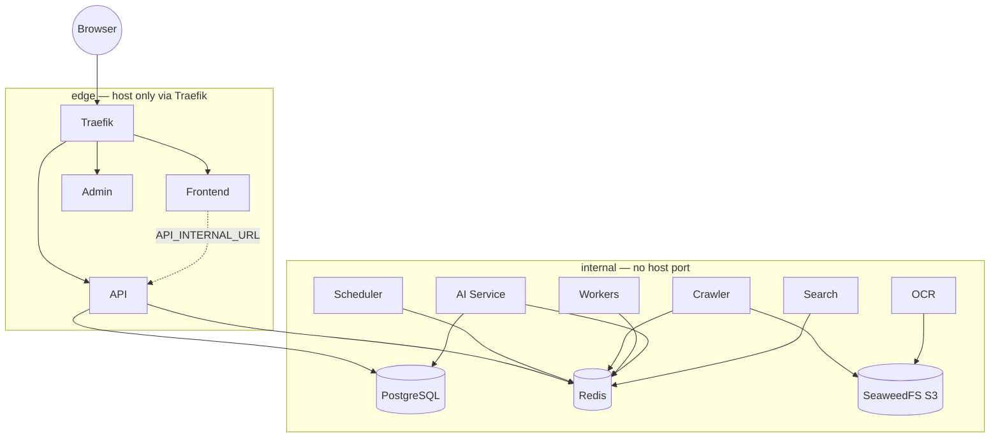

# Container Architecture

> Language: English · [Deutsch (primary)](../CONTAINERS.md)

## Port policy

| Exposed on host | Services |
|-----------------|----------|
| Traefik HTTP/HTTPS | Frontend, Admin, API, Traefik UI, Grafana (Host header) |
| None | Postgres, Redis, SeaweedFS, Worker, Crawler, AI, OCR, Search, Prometheus, Loki |

Optional for local tooling: `docker/compose/docker-compose.dev-ports.yml`.
