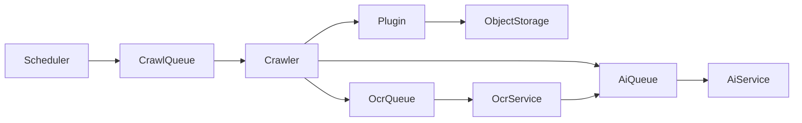

# Crawler Framework

> Language: English · [Deutsch (primary)](../CRAWLER_FRAMEWORK.md)

## Goals

- Discover new events automatically
- Run continuously using scheduled jobs
- Support thousands of sources
- Plugin based architecture
- Fault tolerant
- Horizontally scalable

## Pipeline

## Runtime (M5)

| Component | Role |
|-----------|------|
| `scheduler` | Registers **one** repeatable job per cron pattern; crawler runs matching sources serially |
| `crawler` | Consumes `crawl`, runs plugin lifecycle, stores raw payloads, skips unchanged hashes; with plugin events **one AI job per candidate** |
| `ocr-service` | Consumes `ocr` for image/PDF-marked payloads, writes `.ocr.txt`, enqueues `ai` |
| `ai-service` | Consumes `ai` (Event Intelligence Engine) |
| `plugins/*` | Independently deployable connectors (`html`, `rss`, `ics`, `toubiz`) via Plugin SDK |

New source types are added as plugins under `plugins/` with a `plugin.json` manifest.
Core services discover them at startup (`PLUGINS_DIR`); no core code changes required.

## Change detection

When a crawl produces the same `contentHash` as a prior successful result for the same
source, the job is marked `skipped` (no new object-storage write). Downstream OCR/AI
jobs are still re-enqueued so a prior AI/OCR failure can recover without content changes.
