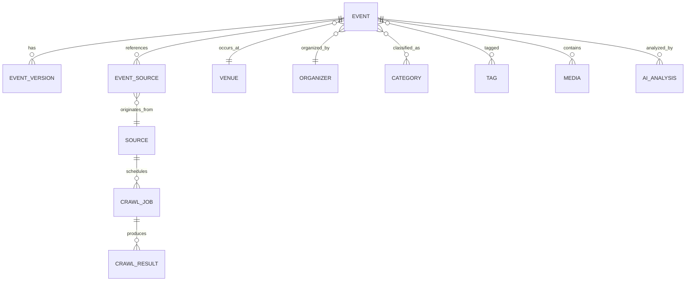

# OpenEventHub Data Model

> Language: English · [Deutsch (primary)](../DATA_MODEL.md)

## Core Principles

- One logical event can have many sources.
- Source data is immutable where possible.
- AI produces normalized event records.
- Every important change is versioned.

## Main Entities

- Event
- EventVersion
- EventSource
- Source
- CrawlJob
- CrawlResult
- Organizer
- Venue
- Region
- Category
- Tag
- Media
- AIAnalysis
- ModerationItem
- UserSubmission

## Entity Relationship

## Event Lifecycle

Discovery → AI Extraction → Deduplication → Moderation (optional) → Publish → Versioning
