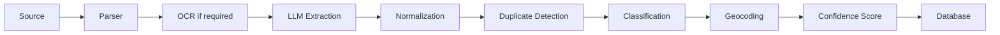

# Event Intelligence Engine (EIE)

> Language: English · [Deutsch (primary)](../EVENT_INTELLIGENCE_ENGINE.md)

## Purpose

The Event Intelligence Engine is the core component of OpenEventHub.

Responsibilities:
- Detect events
- Extract structured information
- Merge information from multiple sources
- Calculate confidence score
- Detect duplicates
- Assign categories
- Detect regions
- Detect organizers
- Detect venues
- Generate searchable metadata

## Processing Pipeline

## Persistence after crawl ingest

Crawl jobs first create a `CrawlResult` (+ object storage) and enqueue raw content on
the `ai` queue. The EIE then:

1. prepares content for the LLM (HTML → plain text, length cap),
2. extracts and classifies,
3. when `isEvent` + title + `startAt` are present (and **not expired**: effective end
   `endAt` or `startAt` ≥ now) and `eventId` is missing, creates a
   new `Event` with status `pending_moderation` (plus `EventVersion` and optional
   `EventSource` via `sourceId`),
4. stores `AIAnalysis`,
5. resolves classification labels via **find-or-create** and links categories, tags,
   regions, and optionally a venue.

Multi-event listing pages:

- The **HTML plugin** (`1.3.0+`) detects events markup-agnostically (table, list,
  div/Divi, JSON-LD, `<time>`, plain date lines) and embedded EMS widgets
  (Toubiz → API, **all future** dates including pagination/`dateIntervals`).
- The crawler then enqueues **one AI job per candidate** (structured short text)
  instead of sending the full HTML page once to the LLM.
- Dedicated `toubiz` plugin for sources wired directly as EMS.
- Fallback with no plugin hits: extraction prompt `event-extraction` **1.0.1**
  still returns **one** primary event per job (earliest dated entry).
- Structured plugin candidates are persisted even if the LLM sets `isEvent=false`
  (guard in the AI service).
- Everywhere: **only non-expired** events (plugins, crawler filter, AI ingest).
- Without a clock time in the source: events are stored as **all-day** (`allDay`);
  UI and ICS must not invent times (no `01:00`/`02:00` from UTC midnight).

Without `eventId` and without a creatable extraction, the AI result is not persisted
(warning in logs).
